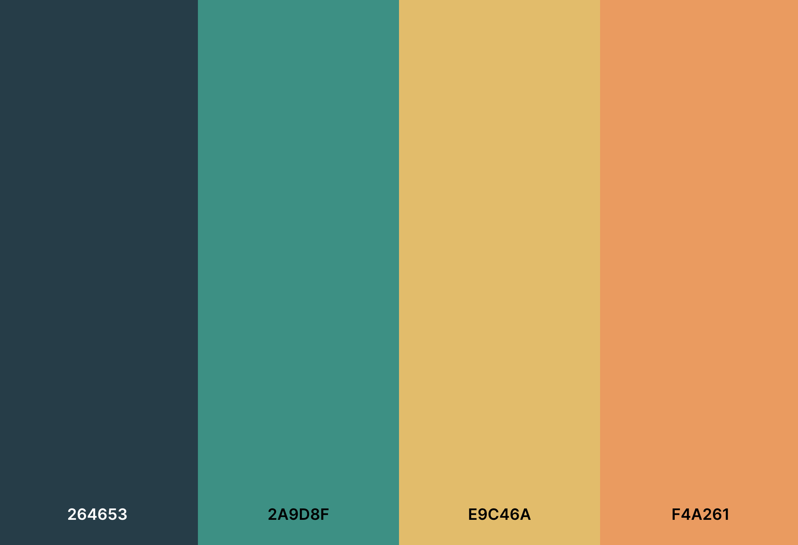

# Whether Weather

Whether Weather is a website designed to provide weather information for designated cities

## Deployment

The website has been deployed here: [Whether Weather](https://whetherweatherapp.netlify.app/)

## Features

- **Daily Weather Summaries**: Provides a daily weather summary for each city the site has access to
- **Hourly Weather Breakdowns**: Provides hourly weather breakdowns for each city on the city focus page
- **Preferences**: Allows the user to chose their weather preferences and favourite cities.
- 

## Pages
### Index / Home
Home page displaying cards for each of the cities, representing their weather summary of the day. Each card is clickable, and will bring the user to the City Focus page of the clicked city

### City Focus
This page provides information for a specific cities weather. 
- Initially, a summary card of todays weather is seen for quick information.
- A table displaying the hourly weather breakdown for today is then seen.
- The next section contains cards, summarising the next 6 days of weather in the specific city. These cards are clicked
- When one of the following 6 day cards are clicked, a hourly breakdown table of that day will appear.

### Preferences
This page contains two boxes where the user can customise their experience on the site.
- Favourite Cities
- - Users can chose their favourite cities, which will be displayed on the favourite cities page. This information is stored in local storage
- Hourly Weather Preferences
- - Users can choose which data points they want to see displayed on the hourly breakdown tables. This information is stored in local storage

### Favourite Cities
This page shows summary cards of todays weather of only the chosen cities in the preferences page. If no favourite cities have been selected, the page will display a message stating this, directing users to the preference page if they would like to avail of this feature.

## Design

### Intention
The design intention was to create a well laid out and simple website to allow for easy navigation. I wanted the user to be able to easily find the information they require, especially when it came to the hourly weather table, as there is a lot of data points in the one space. 

### Colours Used

## Technologies used

- [Javascript] (https://en.wikipedia.org/wiki/JavaScript) for handling and rendering data and components
- [HTML5](https://html.com/html5/) as the main language to produce the pages
- [CSS3](https://en.wikipedia.org/wiki/CSS) to style web elements
- [Eleventy](https://www.11ty.dev/) as a static site generator
- [Nunjucks](https://v0-7-1.11ty.dev/docs/languages/nunjucks/) as the sites templating engine to produce templates of the HTML elements
- [Netlify](https://netlify.com/) - for site deployment

## Learning resources
 - [Nunjucks](https://www.11ty.dev/docs/languages/nunjucks/) - Docs to understand correct templating techniques
 - [11ty](https://www.11ty.dev/docs/) - to navigate 11ty installation and procedures
 - [FreeCodeCamp](https://www.freecodecamp.org/) - Tutorials on local storage etc. 

